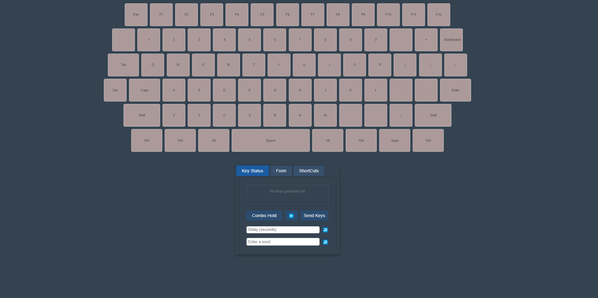

# WebSocket TTS Interface

This project is a WebSocket front-end interface, server, and remote client for sending keystrokes, or executing TTS remotely to the websocket client.

## Features

- **On-Screen Keyboard**: A fully interactive on-screen keyboard with keypress functionality.
- **Text-to-Speech (TTS)**: Ability to send text messages for TTS with configurable volume.
- **Customizable Settings**: Includes options to add delays between key presses, add words, and send keystrokes with or without combo hold.
- **Primarily directx compliant**: Games will recognize keystrokes.

## Screenshots


## The webserver is meant to be hosted on a VPS, or otherwise made available to access over http

## The client is run on some target computer, and ideally set to run on startup.



### Keystroke execution JSON structure:

```
{
  "event": "keypress",
  "data": {
    "keys": [
      { "press": "A" },
      { "press": "B" },
      {
        "combo": {
          "hold": ["Ctrl"],
          "press": ["B"]
        }
      },
      { "delay": "0.5" },
      { "press": "C" }
    ]
  }
}
```

### TTS JSON structure:

```
{
  "event": "tts",
  "data": {
    "message": "hahaha",
    "volume": "1"
    }
}
```
