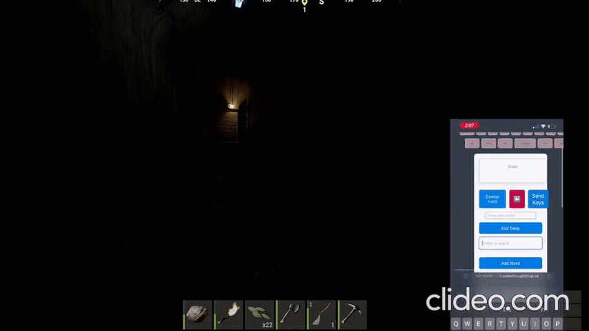

# WebSocket TTS Interface

This project is a WebSocket front-end interface, server, and remote client for sending keystrokes, or executing TTS remotely to the websocket client.

## Features

- **On-Screen Keyboard**: A fully interactive on-screen keyboard with keypress functionality.
- **Text-to-Speech (TTS)**: Ability to send text messages for TTS with configurable volume.
- **Customizable Settings**: Includes options to add delays between key presses, add words, and send keystrokes with or without combo hold.
- **Primarily directx compliant**: Games will recognize keystrokes.

## Screenshots



## The webserver is meant to be hosted on a VPS, or otherwise made available to access over http

## The client is run on some target computer, and ideally set to run on startup.


### TTS JSON structure:

```
{
  "properties": {
    "message": {
      "title": "The message to be converted to speech",
      "type": "string"
    },
    "volume": {
      "maximum": 1.0,
      "minimum": 0.0,
      "title": "The volume of the audio TTS to be played",
      "type": "number"
    }
  },
  "required": [
    "message",
    "volume"
  ],
  "title": "TTSData",
  "type": "object"
}
```

### Keystroke execution JSON structure:

```
{
  "$defs": {
    "ComboAction": {
      "properties": {
        "hold": {
          "items": {
            "type": "string"
          },
          "minItems": 0,
          "title": "The list of keys to be held down while the seqyence of 'press' is executed",
          "type": "array"
        },
        "press": {
          "items": {
            "type": "string"
          },
          "minItems": 1,
          "title": "The list of keys to be pressed",
          "type": "array"
        }
      },
      "required": [
        "hold",
        "press"
      ],
      "title": "ComboAction",
      "type": "object"
    },
    "DelayAction": {
      "properties": {
        "delay": {
          "title": "Delay",
          "type": "string"
        }
      },
      "required": [
        "delay"
      ],
      "title": "DelayAction",
      "type": "object"
    },
    "PressAction": {
      "properties": {
        "press": {
          "title": "Press",
          "type": "string"
        }
      },
      "required": [
        "press"
      ],
      "title": "PressAction",
      "type": "object"
    },
    "WordAction": {
      "properties": {
        "word": {
          "title": "Word",
          "type": "string"
        }
      },
      "required": [
        "word"
      ],
      "title": "WordAction",
      "type": "object"
    }
  },
  "properties": {
    "keys": {
      "items": {
        "anyOf": [
          {
            "$ref": "#/$defs/PressAction"
          },
          {
            "$ref": "#/$defs/ComboAction"
          },
          {
            "$ref": "#/$defs/WordAction"
          },
          {
            "$ref": "#/$defs/DelayAction"
          }
        ]
      },
      "minItems": 1,
      "title": "The list of actions to be performed",
      "type": "array"
    }
  },
  "required": [
    "keys"
  ],
  "title": "EventData",
  "type": "object"
}
```

# Scheduling with Windows task scheduler:

<details>
  <summary>Click to expand</summary>
  
```
hit win+r or super+r
```
and type

```
taskschd.msc
```

into the run prompt.


Name the task, adjust these settings as you see fit.


Go to the settings tab to handle task lifecycle.


Go to actions tab, click new, and locate the installed version of python.


Use pythonw.exe for headless. Arguements will be where the python WS client is.


Finally head to triggers, dicate when the script should be triggered to start.


</details>
